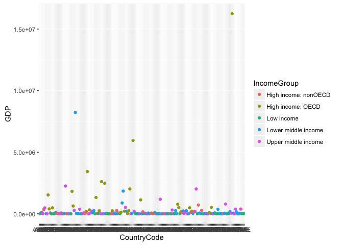

Country Data
================

In this case study, we will be examining various countries and will compare their GDP and Income Group alongside all other countries.

Importing, cleaning and merging data has been documented in the [MakeFile](MakeFile.Rmd) located in this same project.

The original data set we used included 210 countries, but when merging upon another data set to gain inference on GDP, we only matched 189 of these countries in both data sets.

``` r
countries = read.csv('data/Countries.csv')
original.education.data = read.csv('data/education-clean.csv')
nrow(original.education.data) - nrow(countries)
```

    ## [1] 21

First we sort the data and find the 13th country "KNA".

``` r
countries[order(countries$GDP),][13,]
```

    ##    CountryCode GDP         IncomeGroup
    ## 93         KNA 767 Upper middle income

The following are the average GDP rankings for the Income Groups "High Income: OECD" and "High income nonOECD" respectively.

``` r
currencyFormat(mean(countries[countries$IncomeGroup == 'High income: nonOECD',]$GDP))
```

    ## [1] "$104,349.8"

``` r
currencyFormat(mean(countries[countries$IncomeGroup == 'High income: OECD',]$GDP))
```

    ## [1] "$1,483,917"

Here is a plot of GDP for all countries. Countries are colored to group by Income Group.

``` r
library('ggplot2')
ggplot(countries, aes(x=CountryCode, y=GDP, colour=IncomeGroup)) + geom_point() + scale_fill_manual(values=c('#CC6666', '#9999CC', '#66CC99', '#3c0', 'c65', '3c9'))
```



Finally, we split the countries into five different groups based on their GDP. The result is the number of countries in the first quantile who are also in the Income Group "Lower middle income".

``` r
countries$quantile = with(countries, cut(GDP,
  breaks=quantile(GDP, probs=seq(0,1, by=.20), na.rm=TRUE),
  include.lowest=TRUE, labels=c("1","2","3","4","5")))
first.quantile = countries[countries$quantile=='1',]
lower.middle.income.in.first.quantile = first.quantile[first.quantile$IncomeGroup == 'Lower middle income',]
nrow(lower.middle.income.in.first.quantile)
```

    ## [1] 16

In summary, we can make a few observations from the data. First, it appears that countries who participate in OECD tend to have a higher GDP than countries, in their same Income Group, who do not participate in OECD. Also, the "Lower middle income" group is disproportionately represented in the lowest GPA quantile.
